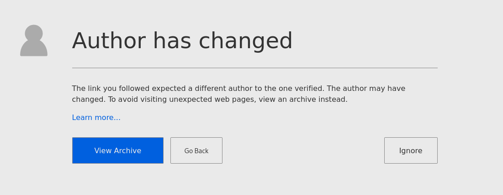

# Linking to Signed Web Pages

To ensure a link to a webpage is signed by a specific author, assign the link a key using a `<meta>` tag.

```markup
<meta name="webverify" content="https://your.domain/* 2020-11-25 AKEY1ID123" />
```

* `name` must be `webverify`
* `content` must be one of:
  * `[url_prefix] [verify_date] [key_id]`
  * `[url_prefix] [key_id]`
* `url_prefix` must end in a `*`.
* `key_id` must be a 16-character long Key ID.
* `verify_date` must be in [ISO 8601](https://en.wikipedia.org/wiki/ISO_8601) format.

You can use multiple tags to match multiple links. The first `key_id` of the first `url_prefix` that matches will be enforced.

The `verify_date` is used for archive lookups if the author of the linked webpage fails to match. It should be the date you last verified the authorship of the pages under the `url_prefix`.


Support for URL patterns and identifiers \(like Fingerprints\) will be added in the future.


## Example

```markup
<meta name="webverify" content="https://your.domain/* 2020-11-25 AKEY1ID123" />
<meta name="webverify" content="https://example.com/users/bob* BKEY2ID567" />
<meta name="webverify" content="https://example.com/* CKEY3ID890" />
```

In the above example `https://example.com/users/bob/timeline` will match `BKEY2ID567` whereas `https://example.com/home` will match `CKEY3ID890`.



## Automation

Generating `<meta>` tags can be automated by scripting the following:

1. Find all the links on the webpage.
2. Fetch each page, verify the signature and extract the `key_id` from it.
3. Assign the current date as `verify_date`
4. Assign the link as `url_prefix`

Once initially fetched, `<meta>` data should not be automatically changed. If your automation detects a `key_id` change, ensure any new authors are still valid and verified.

## Archives

To ensure pages have valid archives to fall back to for the given date, make sure it's saved in the [Internet Archive](https://archive.org/web/).

