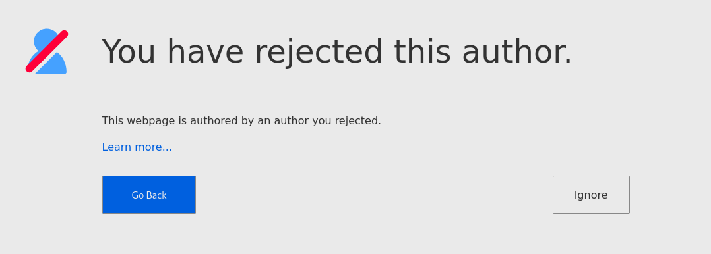

# Verifying Authors

Just because a page is verified does not mean the author is credible. They may be impersonating someone else \(in which case their Key ID won't match the real person\), or they might just have the same name.

Who you trust and don't trust is ultimately up to you. Once you've personally verified an author, you can chose to "Approve" or "Reject" them.

Approving an author will highlight their icon in blue to show you've already verified them. It's similar to a bookmark.

Rejecting an author highlights their icon in blue with a red line across. Visiting a page authored by a rejected author will redirect to a warning page. You can choose to ignore the warning for the current tab.


More features around Author Management will be added in the future.


